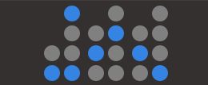

# Binary clock

A nerdy Gnome shell extension that displays the current time in Decimal or Binary-coded Decimal(BCD).

## Install

1. Navigate to [extensions.gnome.org](https://extensions.gnome.org)
2. Search for Binary Clock to install

## Contributing

PRs are welcome for bug fixes. However, for new features, first open an issue.

## Acknowledgment

The Makefile used in this project is derived from [Autohide Battery](https://github.com/ai/autohide-battery).
A big thank you to Andrey Sitnik the maintainer of the project.
